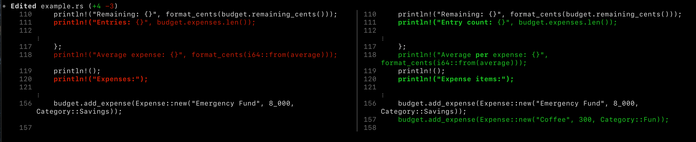
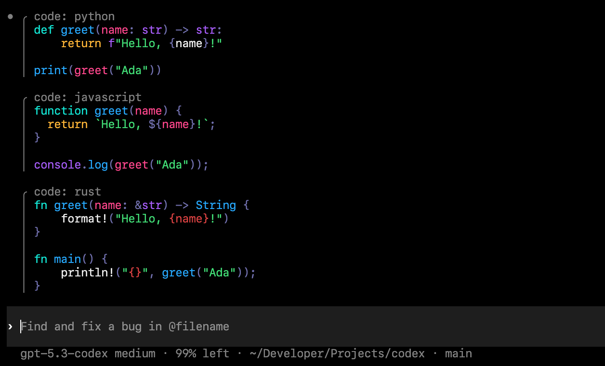
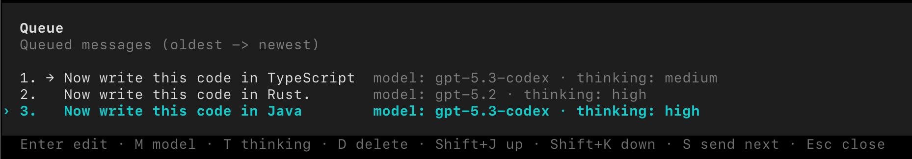
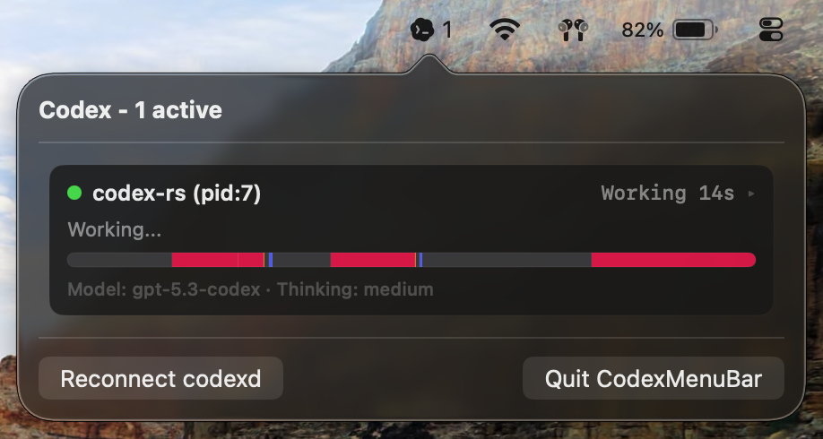
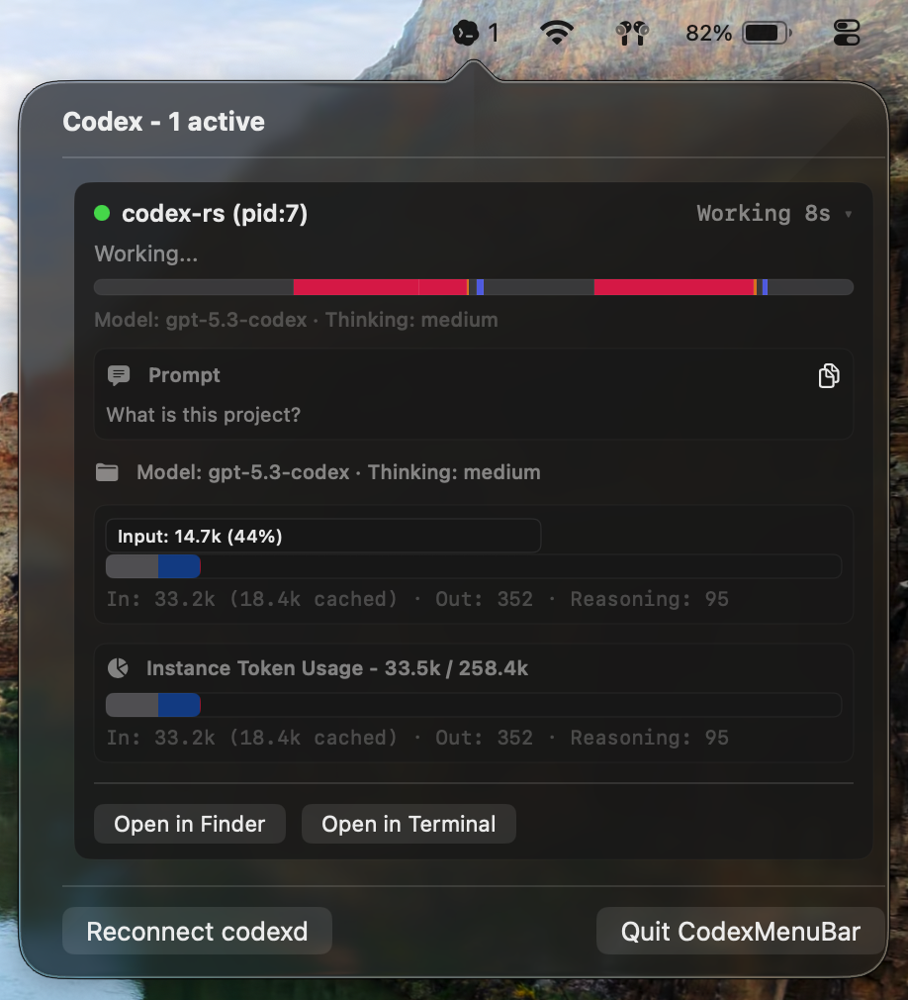
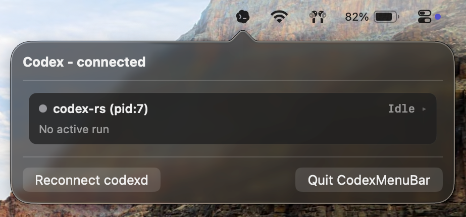

<p align="center"><code>npm i -g @openai/codex</code><br />or <code>brew install --cask codex</code></p>
<p align="center"><strong>Codex CLI</strong> is a coding agent from OpenAI that runs locally on your computer.
<p align="center">
  
</p>
</br>
If you want Codex in your code editor (VS Code, Cursor, Windsurf), <a href="https://developers.openai.com/codex/ide">install in your IDE.</a>
</br>If you are looking for the <em>cloud-based agent</em> from OpenAI, <strong>Codex Web</strong>, go to <a href="https://chatgpt.com/codex">chatgpt.com/codex</a>.</p>

---

## Changes in this fork

This fork adds several TUI features, better diff rendering, message queueing, and a macOS menu bar app for monitoring background tasks.

### TUI & Diff Rendering

<p align="center">
  
</p>

<p align="center">
  
</p>

*   **Syntax Highlighting**: Added `syntect` for actual syntax highlighting in Markdown and code blocks. You can use the built-in themes or point it to a VS Code `.json` theme file.
*   **Diff Views**: Rewrote `/diff` and the patch approval UI. It now supports four modes: `pretty` (highlighted with line numbers), `side-by-side` (with intra-line word diffs), `inline`, and `line`.
*   **Progress Tracing**: The status indicator now has a timeline bar showing exactly what the agent is doing (running tools, editing files, waiting on network, reasoning, etc.). Added `/legend-mode` to toggle the label explanations.

### Workflow & Quality of Life

*   **Advanced Session Manager**: Added `/session` and `/archived` commands that open a paginated, full-screen data table of your past chats. It features columns for timestamps, git branches, and working directories, and allows you to toggle sorting (`Tab`), toggle active/archived views (`a`), and type to search.

<p align="center">
  
</p>

*   **Queue Editing**: Messages typed while the agent is running are now queued instead of blocked. Added a `/queue` command (and an `Alt+Up` shortcut) that opens a UI to edit, reorder, or delete your queued drafts.
*   **Model & Reasoning Hotkeys**: Use `Ctrl+Shift+Left/Right` to cycle models and `Ctrl+Shift+Up/Down` to change reasoning effort on the fly. You can switch these mid-turn, or assign specific overrides to individual messages in your queue.
*   **Forward Backtracking**: If you press `Esc` to edit a previous message and go too far back, you can now press `Shift+Esc` (or `Right Arrow`) to step forward through your history.
*   **Custom Keybindings**: Added a `[keybindings]` block to `config.toml` so you can remap editor movement, submit, newline, paste, and copy actions.
*   **Copying & Exporting**:
    *   Added interactive pickers to copy specific code blocks (`/copy-code`), previous messages (`/copy-messages`), or the last output (`/copy-last-output`).
    *   Added `/export` to dump chat histories to Markdown or JSON. It automatically strips out hidden system prompts (like Agents.md context) to keep the transcript clean.

### macOS Menu Bar App

Added a standalone Swift menu bar app (`CodexMenuBar`) and a local background daemon (`codexd`). The menu bar app connects to the daemon to show live states across all your active terminal sessions without needing to keep the terminal focused.

<p align="center">
  
</p>

*   **Live Progress**: Tracks active turns and renders the same terminal-style progress timeline (Working, Done, Interrupted) with precise elapsed timers.

<p align="center">
  
</p>

*   **Expanded Details**: Clicking a session expands it to show the current prompt, running terminal commands, active file edits, and live token usage.

<p align="center">
  
</p>

*   **Quick Actions & Warnings**: Includes a "Quick Start" button to launch a new terminal session, buttons to open a session's working directory in Finder/Terminal, and warnings when your API rate limits drop below 10%.

### Core Engine Tweaks

*   **Auto-Renaming**: If you finish a turn in an "Untitled" thread, Codex will run a background request to generate a short, relevant title for the chat.
*   **Server Connectivity**: The App Server now supports Unix Domain Sockets as well as authenticated WebSockets (via Bearer token or URL parameter).
---

## Quickstart

### Installing and running Codex CLI

Install globally with your preferred package manager:

```shell
# Install using npm
npm install -g @openai/codex
```

```shell
# Install using Homebrew
brew install --cask codex
```

Then simply run `codex` to get started.

<details>
<summary>You can also go to the <a href="https://github.com/openai/codex/releases/latest">latest GitHub Release</a> and download the appropriate binary for your platform.</summary>

Each GitHub Release contains many executables, but in practice, you likely want one of these:

- macOS
  - Apple Silicon/arm64: `codex-aarch64-apple-darwin.tar.gz`
  - x86_64 (older Mac hardware): `codex-x86_64-apple-darwin.tar.gz`
- Linux
  - x86_64: `codex-x86_64-unknown-linux-musl.tar.gz`
  - arm64: `codex-aarch64-unknown-linux-musl.tar.gz`

Each archive contains a single entry with the platform baked into the name (e.g., `codex-x86_64-unknown-linux-musl`), so you likely want to rename it to `codex` after extracting it.

</details>

### Using Codex with your ChatGPT plan

Run `codex` and select **Sign in with ChatGPT**. We recommend signing into your ChatGPT account to use Codex as part of your Plus, Pro, Team, Edu, or Enterprise plan. [Learn more about what's included in your ChatGPT plan](https://help.openai.com/en/articles/11369540-codex-in-chatgpt).

You can also use Codex with an API key, but this requires [additional setup](https://developers.openai.com/codex/auth#sign-in-with-an-api-key).

## Docs

- [**Codex Documentation**](https://developers.openai.com/codex)
- [**Contributing**](./docs/contributing.md)
- [**Installing & building**](./docs/install.md)
- [**Open source fund**](./docs/open-source-fund.md)

This repository is licensed under the [Apache-2.0 License](LICENSE).
